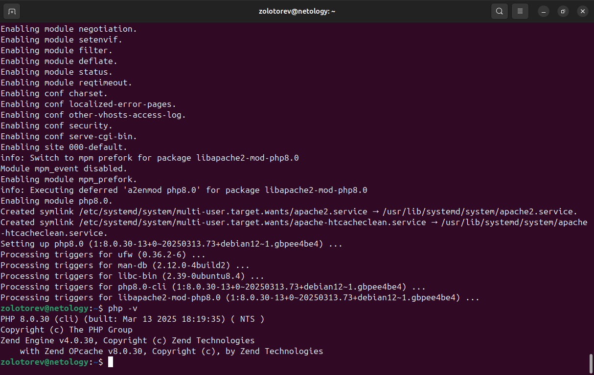

# 

### Задание 1
Опишите достоинства и недостатки работы с пакетным менеджером и репозиторием.

Напишите ответ в свободной форме.

### Решение 1

    Достоинство работы с пакетным менеджером заключается в том, что он позволяет установить в систему уже откомпилированную программу, готовую к работе. В Linux данная программа назвается пакет. По сути, это архив специального формата, который содержит все необходимые приложению бинарные и конфигурационные файлы. Кроме этого, информацию о том, как их следует разместить в файловой системе, данные о зависимостях пакета, а также список действий которые необходимо выполнить в процессе установки. Благодаря информации, хранимой в пакете, пакетный менеджер может обновлять, обрабатывать зависимости, доустанавливать необходимые дополнительные пакеты, а также удалять все компоненты программы. Большинство пакетов хранятся в репозиториях, которые автоматически настраиваются в процессе установки.

    Не все программы можно найти в стандартных репозиториях. Некоторые разработчики выкладывают свои программные продукты в собственные репозитории. Соответственно, для установки нужной программы необходимо прописать сторонний репозиторий, а также скачать pgp-ключ репозитория для проверки подлинности устанавливваемых файлов.

### Задание 2
Ответьте на вопросы:

  1. Какие действия надо выполнить при подключении стороннего репозитория,
  2. В чём опасность такого способа распространения ПО и как это решить.

Напишите ответ в свободной форме.

### Решение 2

Для подключения стороннего репозитория нужно:
  1. Скачать необходимое ПО: apt-transport-https, lsb-release, ca-certificates
  2. Указать репозиторий в source.list пакетного менеджера
  3. Скачать pgp-ключ репозитория

В таких репозиториях может распространяться вредоносное ПО

Решается данная проблема следующим образом: выбираются репозитории, содержащие pgp-ключ и установавливается антивирусное ПО.

### Задание 3

   1. Запустите свою виртуальную машину.
   2. Найдите в репозиториях и установите пакет htop. Какие зависимости требует htop?

Ответ приведите в виде текста команды, которой вы это выполнили, а также приложите скриншот места расположения исполняемых файлов установленного ПО.

### Решение 3 

### Задание 4

    Подключите репозиторий PHP и установите PHP 8.0. В зависимости от вашего дистрибутива, если эта версия у вас уже есть, то установите более свежую версию.

Приложите скриншот содержимого файла, в котором записан адрес репозитория.

    При помощи команды php -v убедитесь, что поставлена корректная версия PHP.

Приложите к ответу скриншот версии.
 
### Решение 4

### Задание 5

Ваш коллега-программист просит вас установить модуль google-api-python-client на сервер, который необходим для программы, работающей с Google API.

Установите этот пакет при помощи менеджера пакетов pip.

Примечение №1: для установки может понадобиться пакет python-distutils, проверьте его наличие в системе.

Примечение №2: не забудьте выдать права на исполнение скачанному файлу. Возможно, будет ошибка при установки при помощи Python версии 2, в таком случае воспользуйтесь командой python3.

Приложите скриншоты с установленным пакетом python-distutils, с версией Pip и установленными модулями, они должны быть видимы.

